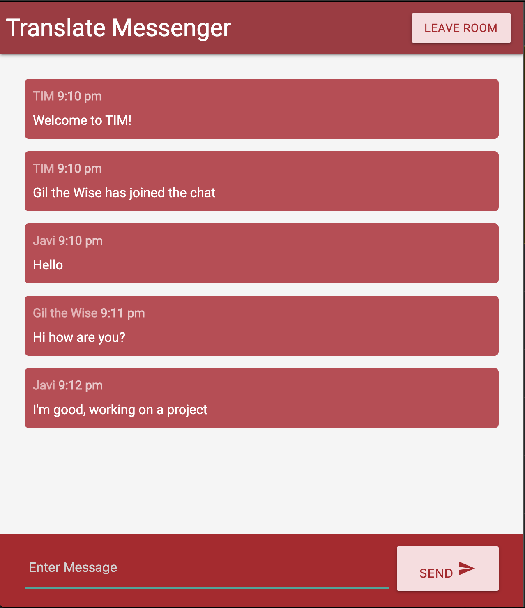
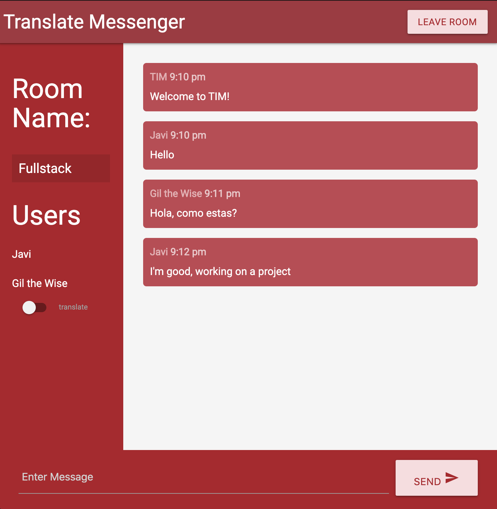

# Translate Instant Messenger

Messenger application that allows user to message between eachother.

- Real-time
- Translation
- Notifications
- Add typing notification (someone is typing…)

## Usage

Use the package manager [pip](https://pip.pypa.io/en/stable/) to install foobar.

- Socket
- Express
- Materialize
- Electron
- Google translate api

## How to use

Need to download both repos to get to up and running. Need to get your own api key.

Client side:

```javascript

npm install && npm start

```

Server side:

```javascript

npm install && npm start-dev

```

## Samples




